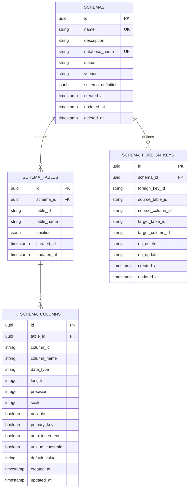
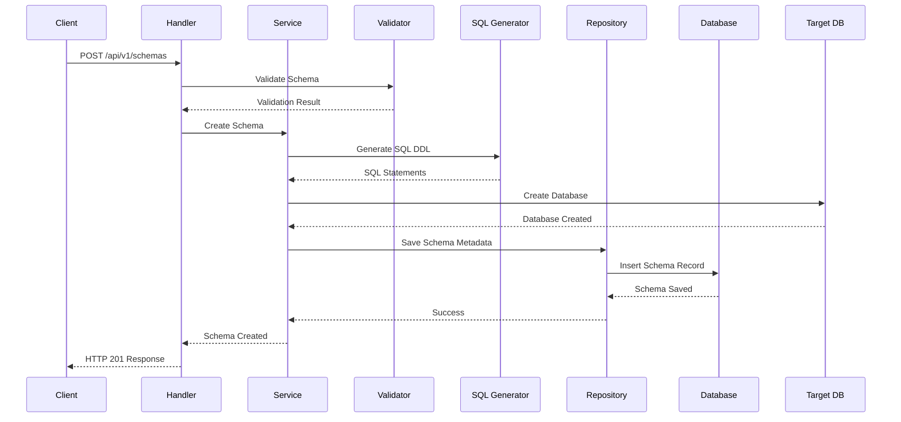
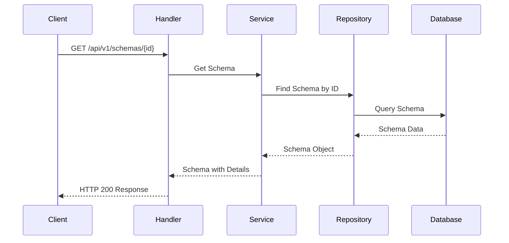

# Database Schema Builder - Engineering Documentation

## Project Overview
Backend API service for a no-code database schema builder that enables visual database design through drag-and-drop interface with automatic SQL database generation.

## Technology Stack
- **Language**: Go 1.24
- **Web Framework**: Gin-Gonic
- **Database**: PostgreSQL (main app) + Dynamic PostgreSQL databases (generated)
- **ORM**: GORM
- **Development Tool**: Air (hot reloading)
- **Architecture Pattern**: Clean Architecture / MVC

## System Architecture

### High-Level Architecture
```
Frontend (React/Vue) 
    ↓ HTTP/JSON
API Gateway/Load Balancer
    ↓
Go Backend Service (Gin)
    ↓
┌─────────────────────────────────────┐
│         Backend Components          │
├─────────────────────────────────────┤
│ • API Layer (Handlers/Routes)       │
│ • Service Layer (Business Logic)    │
│ • Repository Layer (Data Access)    │
│ • Models (Data Structures)          │
└─────────────────────────────────────┘
    ↓
┌─────────────────────────────────────┐
│          Database Layer             │
├─────────────────────────────────────┤
│ • Main App DB (Schema Metadata)     │
│ • Generated DBs (User Schemas)      │
└─────────────────────────────────────┘
```

### Component Architecture
```
┌──────────────────┐    ┌──────────────────┐    ┌──────────────────┐
│   API Handlers   │───▶│    Services      │───▶│   Repositories   │
│                  │    │                  │    │                  │
│ • Schema CRUD    │    │ • Schema Service │    │ • Schema Repo    │
│ • Validation     │    │ • SQL Generator  │    │ • DB Manager     │
│ • Export/Import  │    │ • DB Manager     │    │                  │
└──────────────────┘    └──────────────────┘    └──────────────────┘
```

## Database Integration & JSONB Handling

### PostgreSQL JSONB Integration
The application extensively uses PostgreSQL's JSONB functionality to store complex schema definitions. This requires proper serialization/deserialization handling.

**SchemaData JSONB Implementation:**
```go
// SchemaData implements sql.Scanner and driver.Valuer for GORM JSONB support
type SchemaData struct {
    Tables      []Table      `json:"tables"`
    ForeignKeys []ForeignKey `json:"foreignKeys"`
    Version     string       `json:"version"`
    ExportedAt  string       `json:"exportedAt,omitempty"`
}

// Value implements driver.Valuer interface for database storage
func (s SchemaData) Value() (driver.Value, error) {
    return json.Marshal(s)
}

// Scan implements sql.Scanner interface for database retrieval
func (s *SchemaData) Scan(value interface{}) error {
    // Handles null values, byte arrays, and strings
    // Provides safe defaults when data is malformed
}
```

**Key JSONB Handling Features:**
- **Safe Null Handling**: Automatically initializes empty structures for null JSONB fields
- **Multiple Format Support**: Handles both `[]byte` and `string` inputs from PostgreSQL driver
- **Error Recovery**: Gracefully handles JSON unmarshal errors with safe defaults
- **Type Safety**: Ensures GORM can properly serialize/deserialize complex nested structures

### Repository Layer Defensive Programming
```go
// Safe null checking prevents runtime panics
func (r *schemaRepository) List(pagination models.PaginationRequest) ([]models.SchemaListResponse, int, error) {
    // Convert to response format with safe access
    for _, schema := range schemas {
        tableCount := 0
        if schema.SchemaDefinition.Tables != nil {
            tableCount = len(schema.SchemaDefinition.Tables)
        }
        // ... rest of conversion
    }
}
```

## Common Issues & Solutions

### JSONB Deserialization Errors
**Problem**: `sql: Scan error on column index X: unsupported Scan, storing driver.Value type []uint8 into type *models.SchemaData`

**Root Cause**: GORM cannot automatically handle complex struct types in JSONB fields without proper interface implementation.

**Solution**: 
1. Implement `sql.Scanner` interface for reading from database
2. Implement `driver.Valuer` interface for writing to database  
3. Add defensive null checking in business logic
4. Provide safe default values for malformed JSON

**Implementation Pattern:**
```go
type ComplexJSONField struct {
    // ... struct fields
}

func (c ComplexJSONField) Value() (driver.Value, error) {
    return json.Marshal(c)
}

func (c *ComplexJSONField) Scan(value interface{}) error {
    if value == nil {
        *c = ComplexJSONField{} // Safe default
        return nil
    }
    
    var bytes []byte
    switch v := value.(type) {
    case []byte:
        bytes = v
    case string:
        bytes = []byte(v)
    default:
        return errors.New("unsupported scan type")
    }
    
    err := json.Unmarshal(bytes, c)
    if err != nil {
        *c = ComplexJSONField{} // Recovery default
    }
    return nil
}
```

## Project Structure

```
vdt-dashboard-backend/
├── main.go                 # Application entry point
├── go.mod                  # Go module definition
├── go.sum                  # Dependency checksums
├── .env                    # Environment configuration
├── .air.toml              # Air hot reload configuration
├── .gitignore             # Git ignore patterns
├── bin/                   # Compiled binaries
│   └── server.exe
├── docs/                  # Documentation
│   ├── prd.md            # Product Requirements
│   ├── api.md            # API Documentation
│   ├── todos.md          # Task Planning
│   └── engineer.md       # Engineering Documentation
├── config/               # Configuration management
│   ├── config.go        # Configuration structures
│   ├── database.go      # Database configuration
│   └── env.go           # Environment variables
├── models/              # Data models and structures
│   ├── schema.go        # Schema model
│   ├── table.go         # Table model
│   ├── column.go        # Column model
│   ├── foreign_key.go   # Foreign key model
│   └── response.go      # API response structures
├── repositories/        # Data access layer
│   ├── interfaces.go    # Repository interfaces
│   ├── schema_repo.go   # Schema repository implementation
│   └── db_manager.go    # Database management repository
├── services/           # Business logic layer
│   ├── interfaces.go   # Service interfaces
│   ├── schema_service.go      # Schema business logic
│   ├── sql_generator.go       # SQL generation service
│   ├── validator.go           # Schema validation service
│   └── database_manager.go    # Database management service
├── api/                # HTTP API layer
│   ├── handlers/       # Request handlers
│   │   ├── schema.go   # Schema CRUD handlers
│   │   ├── database.go # Database management handlers
│   │   ├── health.go   # Health check handler
│   │   └── validator.go # Validation handlers
│   ├── middleware/     # HTTP middleware
│   │   ├── cors.go     # CORS middleware
│   │   ├── logger.go   # Logging middleware
│   │   ├── error.go    # Error handling middleware
│   │   └── rate_limit.go # Rate limiting middleware
│   ├── routes.go       # Route definitions
│   └── server.go       # HTTP server setup
├── utils/              # Utility functions
│   ├── response.go     # HTTP response utilities
│   ├── validation.go   # Input validation utilities
│   ├── logger.go       # Logging utilities
│   └── uuid.go         # UUID generation utilities
├── migrations/         # Database migrations
│   ├── 001_create_schemas.sql
│   ├── 002_create_tables.sql
│   └── migrate.go      # Migration runner
└── tests/             # Test files
    ├── unit/          # Unit tests
    ├── integration/   # Integration tests
    └── fixtures/      # Test data fixtures
```

## Database Design

### Migration System

The application includes a comprehensive migration system:

**Migration Files:**
- `migrations/001_create_schemas.sql` - Creates main schemas table with indexes and triggers
- `migrations/002_create_tables.sql` - Inserts sample schema data for testing
- `migrations/migrate.go` - Go migration runner with multiple commands

**Migration Commands:**
```bash
# Database setup
make db-create       # Create PostgreSQL database
make db-drop         # Drop database (destructive)
make db-reset        # Drop and recreate database

# Migration operations  
make migrate         # Run all SQL migrations
make migrate-reset   # Reset database with fresh migrations
make migrate-seed    # Seed database with sample data
make migrate-models  # Create/update models using GORM AutoMigrate

# Complete setup
make db-setup        # Complete database setup (create + migrate + seed)
```

**Migration Runner Commands:**
```bash
cd migrations
go run migrate.go up            # Run SQL migrations
go run migrate.go create-models # GORM AutoMigrate
go run migrate.go seed          # Seed sample data
go run migrate.go reset         # Complete reset
```

### Main Application Database (PostgreSQL)
Stores metadata about user-created schemas, not the actual schema data.

### Entity Relationship Diagram (ERD)


### Database Schema Indexes
```sql
-- Performance indexes
CREATE INDEX idx_schemas_name ON schemas(name);
CREATE INDEX idx_schemas_created_at ON schemas(created_at);
CREATE INDEX idx_schemas_status ON schemas(status);
CREATE INDEX idx_schema_tables_schema_id ON schema_tables(schema_id);
CREATE INDEX idx_schema_columns_table_id ON schema_columns(table_id);
CREATE INDEX idx_foreign_keys_schema_id ON schema_foreign_keys(schema_id);
```

## Data Flow Architecture

### Schema Creation Flow


### Schema Retrieval Flow


## Service Layer Architecture

### Schema Service (Core Business Logic)
```go
type SchemaService interface {
    CreateSchema(request CreateSchemaRequest) (*Schema, error)
    GetSchema(id string) (*Schema, error)
    UpdateSchema(id string, request UpdateSchemaRequest) (*Schema, error)
    DeleteSchema(id string) error
    ListSchemas(pagination PaginationRequest) (*PaginatedSchemas, error)
    ValidateSchema(request ValidateSchemaRequest) (*ValidationResult, error)
}
```

### SQL Generator Service
```go
type SQLGeneratorService interface {
    GenerateCreateDatabase(databaseName string) (string, error)
    GenerateCreateTables(schema *Schema) ([]string, error)
    GenerateForeignKeys(schema *Schema) ([]string, error)
    GenerateIndexes(schema *Schema) ([]string, error)
    ValidateSQL(statements []string) error
}
```

### Database Manager Service
```go
type DatabaseManagerService interface {
    CreateDatabase(databaseName string) error
    DropDatabase(databaseName string) error
    ExecuteSQL(databaseName string, statements []string) error
    CheckDatabaseHealth(databaseName string) (*DatabaseHealth, error)
    ListDatabases() ([]string, error)
}
```

## API Layer Architecture

### HTTP Request Flow
```
Client Request
    ↓
CORS Middleware
    ↓
Logging Middleware
    ↓
Error Handling Middleware
    ↓
Rate Limiting Middleware
    ↓
Route Handler
    ↓
Input Validation
    ↓
Service Layer Call
    ↓
Response Formatting
    ↓
Client Response
```

### Error Handling Strategy
```go
type APIError struct {
    Code       string `json:"code"`
    Message    string `json:"message"`
    Details    string `json:"details,omitempty"`
    StatusCode int    `json:"-"`
}

// Error types
const (
    ErrValidation             = "VALIDATION_ERROR"
    ErrSchemaNotFound         = "SCHEMA_NOT_FOUND"
    ErrDatabaseError          = "DATABASE_ERROR"
    ErrDuplicateName          = "DUPLICATE_NAME"
    ErrInvalidJSON            = "INVALID_JSON"
    ErrMissingRequiredField   = "MISSING_REQUIRED_FIELD"
    ErrUnsupportedDataType    = "UNSUPPORTED_DATA_TYPE"
    ErrForeignKeyError        = "FOREIGN_KEY_ERROR"
    ErrDatabaseCreationFailed = "DATABASE_CREATION_FAILED"
    ErrInternalError          = "INTERNAL_ERROR"
)
```

**Error Recovery Patterns:**
- **Database Layer**: Graceful handling of JSONB deserialization errors with safe defaults
- **Repository Layer**: Defensive null checking to prevent runtime panics
- **Service Layer**: Proper error wrapping with context for debugging
- **API Layer**: Consistent error response format with appropriate HTTP status codes

## Security Considerations

### Input Validation
- JSON schema validation for all requests
- SQL injection prevention through parameterized queries
- Column/table name sanitization (SQL-safe naming)
- Data type validation and constraints

### Database Security
- Separate databases for each schema (isolation)
- Connection string security
- Query timeout limits
- Resource usage monitoring

## Performance Optimization

### Caching Strategy
- Schema metadata caching (Redis)
- SQL generation result caching
- Database connection pooling
- Query result caching for read-heavy operations

### Database Optimization
- Proper indexing on frequently queried fields
- Connection pooling configuration
- Query optimization
- Pagination for large result sets

## Monitoring & Observability

### Metrics to Track
- API response times
- Database connection pool usage
- Schema creation success/failure rates
- Generated database health status
- Memory and CPU usage

### Logging Strategy
- Structured logging (JSON format)
- Request/response logging
- Error logging with stack traces
- Performance metrics logging
- Audit trail for schema operations

## Development Workflow

### Environment Setup
1. Install Go 1.24
2. Install PostgreSQL
3. Clone repository
4. Copy `.env.example` to `.env`
5. Run `go mod tidy`
6. Run database migrations
7. Start with `air .`

### Testing Strategy
- Unit tests for all services
- Integration tests for API endpoints
- Database tests with test containers
- Performance benchmarks
- End-to-end workflow testing

### Deployment Architecture
```
Load Balancer
    ↓
Multiple Go App Instances
    ↓
Shared PostgreSQL Cluster
    ↓
Generated Database Instances
```

## Recent Improvements & Lessons Learned

### JSONB Integration Challenges (Resolved)
**Issue**: The `/api/v1/schemas` endpoint was returning 500 errors due to GORM being unable to deserialize PostgreSQL JSONB fields into complex Go structs.

**Root Cause Analysis**:
1. GORM requires explicit interface implementation for complex JSONB fields
2. The `SchemaData` struct lacked proper `sql.Scanner` and `driver.Valuer` interfaces
3. Repository layer had unsafe null pointer access patterns

**Resolution Strategy**:
1. **Interface Implementation**: Added proper JSONB serialization/deserialization methods
2. **Defensive Programming**: Implemented safe null checking throughout the repository layer
3. **Error Recovery**: Added graceful fallbacks for malformed JSON data
4. **Testing**: Verified fix with existing database records containing various data states

**Impact**: 
- ✅ All schema endpoints now function correctly
- ✅ Improved system resilience to data corruption
- ✅ Better error handling patterns established
- ✅ Foundation for reliable JSONB usage across the application

### Best Practices Established
1. **Always implement sql.Scanner/driver.Valuer for JSONB fields**
2. **Use defensive null checking in repository conversions**
3. **Provide safe default values for critical data structures**
4. **Test with real database data during development**
5. **Monitor application logs for serialization errors**

## Future Enhancements

### Scalability Improvements
- Horizontal scaling with load balancing
- Database sharding for generated schemas
- Async processing for heavy operations
- Microservices architecture

### Feature Extensions
- Multiple database engine support
- Schema versioning and migration tools
- Real-time collaboration features
- Advanced query optimization
- Backup and restore capabilities

### Technical Debt & Improvements
- Implement comprehensive JSONB field testing
- Add database migration testing framework
- Enhance error monitoring and alerting
- Implement automated data validation checks

---

## Quick Start Commands

```bash
# Initialize and setup
go mod init vdt-dashboard-backend
go mod tidy

# Run development server
air .

# Run tests
go test ./...

# Build for production
go build -o bin/server.exe main.go

# Run migrations
go run migrations/migrate.go up
```

This engineering documentation provides a comprehensive overview of the system architecture, data models, and implementation strategy for the database schema builder backend.
